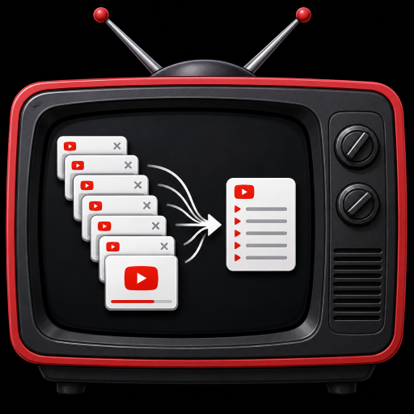

**[Website](https://jdepew88.github.io/TubeStack/)** · **[GitHub](https://github.com/jdepew88/TubeStack)**

<table>
  <tr>
    <td width="240" align="center">
      
    </td>
    <td valign="middle">

# TubeStack

### Your YouTube library in Chrome—save tabs, organize like iTunes, resume where you left off.

   </td>
  </tr>
</table>

TubeStack is a **Chrome extension** (Manifest V3) for people who keep many **YouTube** tabs open. It helps you **save watch and Shorts tabs into a local library**, **close them to free RAM**, and **come back later**—with optional hooks to **YouTube** and **OpenAI** only when you turn them on.

**Local-first:** your library, playlists, and settings stay **on your device** in Chrome extension storage—not on a TubeStack server. TubeStack does **not** request Chrome History permission or scan unrelated browsing history. **[Privacy ↓](#privacy)** · **[Full privacy policy →](docs/PRIVACY.md)**

---

## What TubeStack is and does

Inspired by **OneTab**, built for **YouTube power users**. Instead of leaving dozens of watch or Shorts tabs open, TubeStack collapses them into **organized local playlists** while preserving URLs and **locally tracked watch progress** (full on `/watch`, best-effort on Shorts, for videos you open while the extension is installed).

**Core workflows**

- **Save** open YouTube watch and Shorts tabs from the toolbar or context menu; optionally close tabs after save to cut clutter and RAM use.
- **Queue sidebar** — optional Chrome side panel from the popup (**Open queue sidebar**): pick a queue, drag-reorder videos, add window tabs, **Play** one video at a time with auto-advance, or **Shuffle** the queue order locally then play the same way.
- **Library** view with an iTunes-style **Artist · Album · Category** browser, compact session picker, and searchable video list.
- **Restore** individual videos or whole saved sessions; **focus sessions** and queue tools for intentional watching.
- **Organize** with **Watch States** (workflow status), user-defined **tags**, themes/categories, video and stack notes, timestamp notes, decision logs, priority tiers, and local playlist snapshots.
- **Optional YouTube Data API + OAuth** (your keys): imports, metadata, subscription helpers, create/sync playlists on your Google account.
- **Optional AI provider — OpenAI or Anthropic (Claude)** (your own API key): AI-assisted categorization and optional **Watch State** suggestions from titles/metadata in your saved library (only when you run it; nothing changes until you review the preview and confirm).

TubeStack is **not affiliated with YouTube, Google, OpenAI, or Anthropic.**

### Organization: Tags vs Watch States

TubeStack uses two separate systems:

| System | What it is |
|--------|------------|
| **Tags** | Freeform labels you create (e.g. `React`, `CCNA`, `research`). A video can have many tags. |
| **Watch States** | A fixed workflow status per video: Queue, Watching, Saved, Finished, Important, Reference, Skip, Add to Playlist. Filter and bulk-update from the dashboard and library. |

**Notes** (video notes, timestamp notes, stack notes, research summaries, and decision logs) are stored **locally** in Chrome extension storage. TubeStack does **not** request Chrome History permission or scan unrelated browsing history. Optional OpenAI organization sends **only** metadata for videos you select when you explicitly trigger an AI action.

Chrome Web Store docs: [docs/](docs/) ([listing](docs/STORE_LISTING.md) · [release checklist](docs/RELEASE_CHECKLIST.md))

---

## Features

### OneTab-style YouTube tab saving

- Save all open YouTube tabs into TubeStack playlists
- Close tabs after saving to reduce RAM and browser clutter
- Restore individual videos or entire saved sessions later
- Preserve video URLs and resume positions when possible
- Organize tabs into reusable local playlists stored directly inside the extension

---

### Focus and resource management tools

TubeStack is designed to help reduce YouTube overload, browser clutter, and unnecessary RAM usage from large YouTube tab sessions.

Features include:

- Save tabs instead of leaving them open indefinitely
- Close saved YouTube tabs to reduce browser RAM usage
- OneTab-style YouTube queue management
- **Queue sidebar** in Chrome's side panel (reorder, play one at a time, shuffle queue order)
- Focus sessions
- Queue management
- Prioritization systems
- Locally tracked watch progress on YouTube `/watch` tabs (`videoProgress`, `watchByDay`); best-effort on Shorts — no Chrome History API
- Resume later workflows
- Preserve watch progress when possible

Future versions may include:

- screen-time analytics
- session tracking
- recommendation filtering
- creator frequency analysis
- watch habit insights

---

### Playlist features and long-term YouTube library

TubeStack is designed as more than temporary tab storage.

Instead of losing track of hundreds of YouTube tabs, playlists, and saved videos, TubeStack allows you to build a long-term organized YouTube library directly inside the extension.

TubeStack supports:

- Local playlists stored directly inside the extension
- Favorite videos
- Watch later queues
- Priority systems
- Long-term archives
- Topic-based collections
- YouTube playlist importing/exporting
- One-step local playlist creation by pasting a YouTube playlist URL
- JSON playlist exports with title, creator, URL, duration, Watch State, brief description, tags, categories, and progress

TubeStack organizes videos using:

- **Artists** → YouTube creators/channels
- **Albums** → user-defined topic collections
- **Categories** → organizational groupings

Examples:

```txt
Artist: Linus Tech Tips
Album: Homelab Build Ideas
Category: Networking
```

```txt
Artist: Veritasium
Album: Physics Concepts
Category: Education
```

### AI-assisted categorization (Optional: OpenAI or Anthropic)

TubeStack can optionally use the **OpenAI API** or the **Anthropic API (Claude)** to organize videos. Pick the provider in **Settings → AI categorization**; both support the same modes and options.

- **Scope:** the current playlist, the entire library (sent in batches with one shared category list so results stay consistent), the current filtered view, or checked rows.
- **Preview first:** the AI's proposal is validated and shown as a review table (current → proposed category, new categories). Nothing changes until you click **Apply Changes**; **Cancel** discards it. The last applied run (or category rebuild) can be **undone**.
- **Cost awareness:** before sending, TubeStack shows the provider, model, number of videos, and number of requests. These calls use your own provider API credits.

AI features include:

- Automatic category generation
- Bulk video categorization
- Topic grouping
- Playlist cleanup
- Smart organization suggestions
- Category depth modes (broad vs detailed organization)

---

#### AI categorization modes

##### Let AI decide everything

AI automatically creates and assigns categories.

##### Use my categories

AI sorts videos into categories you already created.

##### Follow my criteria

Describe how you want videos grouped; AI names the categories and assigns videos.

##### Choose category depth

Pick how many categories to generate (2–28) and whether labels should be **Broad** (e.g. Tech, Gaming) or **Specific** (e.g. Android, PC builds).

---

#### How videos are categorized

TubeStack sends only metadata it already stored locally (it does not re-scrape YouTube for this):

- video titles
- creator/channel names
- a short description snippet (when saved)
- tags (when available)
- current category, list category, Watch State, and the video's own note

Not all YouTube videos contain useful tags, so AI can supplement missing metadata and improve organization quality.

---

### YouTube API + OAuth features (Optional)

TubeStack works locally without Google integration, but additional features unlock when connecting your own Google Cloud project and YouTube account.

#### YouTube Data API v3

Used for:

- playlist imports
- metadata retrieval
- subscription analysis
- channel scanning
- playlist synchronization

#### Google OAuth

Used to authenticate actions on your YouTube account.

OAuth unlocks:

- Create YouTube playlists
- Import playlists from your profile
- Export TubeStack playlists to YouTube
- Create playlists as:
  - Public
  - Private
  - Unlisted

TubeStack stores API keys locally on your device using Chrome extension storage.

---

### AI provider integration (Optional: OpenAI or Anthropic)

TubeStack can optionally connect to **OpenAI** or **Anthropic (Claude)** for AI-assisted organization features:

- AI categorization (generate / reorganize categories, assign videos)
- playlist organization
- category rebuild niche suggestions
- Watch State suggestions

Your API keys are stored locally on your device and only used when you run AI features. Only the selected provider is contacted.

---

## Installing TubeStack (Developer Mode)

TubeStack is currently installed as an unpacked Chrome Extension.

### Installation steps

1. Download the TubeStack ZIP or clone this repository
2. Extract/unzip the folder somewhere on your computer
3. Open Google Chrome
4. Navigate to:

```txt
chrome://extensions
```

5. Enable **Developer mode** (top-right corner)
6. Click **Load unpacked**
7. Select the TubeStack folder containing:

```txt
manifest.json
```

TubeStack should now appear in your Extensions manager.

Pin it to the right of the address bar by selecting the puzzle piece and pinning TubeStack.

---

## Privacy

TubeStack is **local-first**: saved videos, playlists, organization data, locally tracked watch progress, and most settings live in **your browser’s extension storage**, not on a TubeStack server. The **`unlimitedStorage`** permission only raises that local quota.

TubeStack does **not** request Chrome History permission and does **not** scan unrelated browsing history. After you accept the in-product privacy notice, TubeStack can **locally record playback progress** for YouTube videos watched in YouTube `/watch` tabs while the extension is installed (best-effort on Shorts), so it can preserve resume position, estimate remaining time, and build Focused Playlists. This playback progress is stored locally in Chrome extension storage (`videoProgress` per video and `watchByDay` for daily totals).

- Progress is observed on **YouTube `/watch` pages** via `content/youtube-progress.js` (heartbeats to the service worker); on Shorts, progress is best-effort. Progress may also be **captured when you save tabs** from the open player or URL timestamp.
- **Does not request** the Chrome **History**, **`tabs`**, or **`windows`** permissions (YouTube tab access is limited by YouTube host permissions).
- **YouTube API keys**, **OAuth client/session data**, and **OpenAI / Anthropic API keys** you provide are stored **locally on your device**.
- **Google**, **OpenAI**, and **Anthropic** are contacted **only when you enable and use** those optional features (for AI, only the provider you selected); requests go **directly** from the extension to those services (not through a TubeStack backend).
- TubeStack **does not sell** your data and complies with Chrome Web Store **Limited Use** requirements (see the privacy policy). You can **delete stored data** from Settings in the extension or by removing the extension.

**[Full privacy policy →](docs/PRIVACY.md)** · **[Permissions & CWS justifications →](docs/PERMISSIONS.md)**

---

## TubeStack setup guide

One-time Google Cloud configuration for the YouTube Data API v3 key and OAuth playlist tools, plus optional OpenAI or Anthropic setup for AI categorization.

**In the extension:**

- **Connect YouTube** ([dashboard/connect-youtube.html](dashboard/connect-youtube.html)) — plain-language, step-by-step sign-in for playlist import/export (OAuth Client ID + test sign-in). No TubeStack server.
- **Setup Integrations** — advanced checklist for YouTube Data API key, OAuth, and AI provider keys (OpenAI / Anthropic).
- Manual fields remain in **Settings**. Full reference: [dashboard/setup-guide.html](dashboard/setup-guide.html).

---

### Google Cloud — one project

TubeStack uses a single Google Cloud project for both:

- YouTube Data API v3
- Google OAuth authentication

Everything can be configured inside Google Cloud Console.

---

#### 1. Create or select a Google Cloud project

Create a dedicated project such as:

```txt
TubeStack
```

---

#### 2. Enable YouTube Data API v3

Navigate to:

```txt
APIs & Services → Library
```

Search for:

```txt
YouTube Data API v3
```

Then click:

```txt
Enable
```

---

#### 3. Create a YouTube API key

Navigate to:

```txt
APIs & Services → Credentials
```

Then:

```txt
Create Credentials → API Key
```

Optional but recommended:

- Restrict the key to YouTube Data API v3 only

Paste the key into:

```txt
TubeStack Settings → YouTube API Key
```

---

#### 4. Configure OAuth consent screen

Navigate to:

```txt
APIs & Services → OAuth consent screen
```

Choose:

```txt
External
```

Fill out:

- App name
- Support email
- Developer contact email

Add the scope:

```txt
https://www.googleapis.com/auth/youtube
```

---

#### Testing mode recommendation

Keep the OAuth app in:

```txt
Testing
```

Do not publish during development.

Under:

```txt
Test users
```

add the Google email accounts allowed to authenticate with TubeStack.

---

#### 5. Create OAuth Client ID

Navigate to:

```txt
APIs & Services → Credentials
→ Create Credentials
→ OAuth Client ID
```

Application type:

```txt
Web application
```

Add the authorized redirect URI shown in TubeStack settings.

Example:

```txt
https://YOUR_EXTENSION_ID.chromiumapp.org/
```

Paste the OAuth Client ID into:

```txt
TubeStack Settings → YouTube OAuth
```

---

### OpenAI setup (Optional)

TubeStack can optionally use OpenAI for AI-powered organization tools.

#### 1. Create an OpenAI API key

Visit:

```txt
https://platform.openai.com/
```

Create an API key and paste it into:

```txt
TubeStack Settings → OpenAI API Key
```

---

#### Important billing note

ChatGPT subscriptions and OpenAI API billing are separate systems.

Using the OpenAI API requires:

- API billing
- prepaid credits
- or active API payment setup

inside the OpenAI Platform account.

---

### Anthropic (Claude) setup (Optional)

TubeStack can use the **Anthropic API** instead of OpenAI. This is an **Anthropic API key**, not a Claude.ai subscription and not Claude Code.

1. Sign in to the Claude Console at `https://platform.claude.com/`, add API credits, and create an API key.
2. In TubeStack: **Settings → AI categorization → Provider: Anthropic (Claude)**, paste the key, pick a model (Claude Opus 5.5 is the default; Sonnet 5.5 and Haiku 4.5 are lower-cost options), and click **Test connection**.

Claude.ai subscriptions and Anthropic API billing are separate. TubeStack cannot see your Anthropic credit balance; if the account is out of credits, AI tools report that clearly and nothing is changed.

---

## Security

**If you develop or fork this repo:** do not commit real API keys, OAuth client secrets, or other credentials to GitHub, and do not paste them into public issues or screenshots.

**If you use TubeStack as an extension:** anything you enter in Settings—YouTube Data API key, OAuth Web Client ID, OpenAI or Anthropic API key—is stored only in **Chrome extension storage on your own device**. TubeStack **does not** upload those values to a TubeStack server or operate a backend that collects your secrets.

You create and control access in **your** cloud accounts (for example **Google Cloud Console** for the YouTube Data API and OAuth client, and **OpenAI** or the **Claude Console** for AI API keys). Those services decide what your project is allowed to do; the extension keeps your credentials **locally** and, when you run a feature that needs them, sends requests **directly from your browser** to Google, OpenAI, or Anthropic—not through TubeStack.

For more detail, see **[PRIVACY.md](docs/PRIVACY.md)**.

---

## Disclaimer

TubeStack is not affiliated with YouTube or Google.

Use YouTube API, OAuth, downloads, and AI integrations responsibly and in accordance with applicable platform terms and laws.

---

## License

MIT — see `LICENSE`
